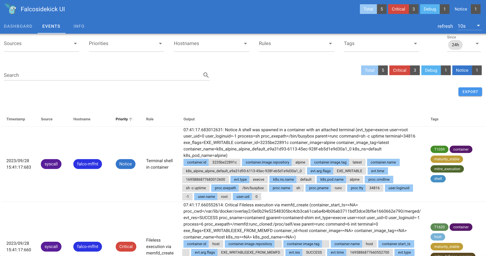
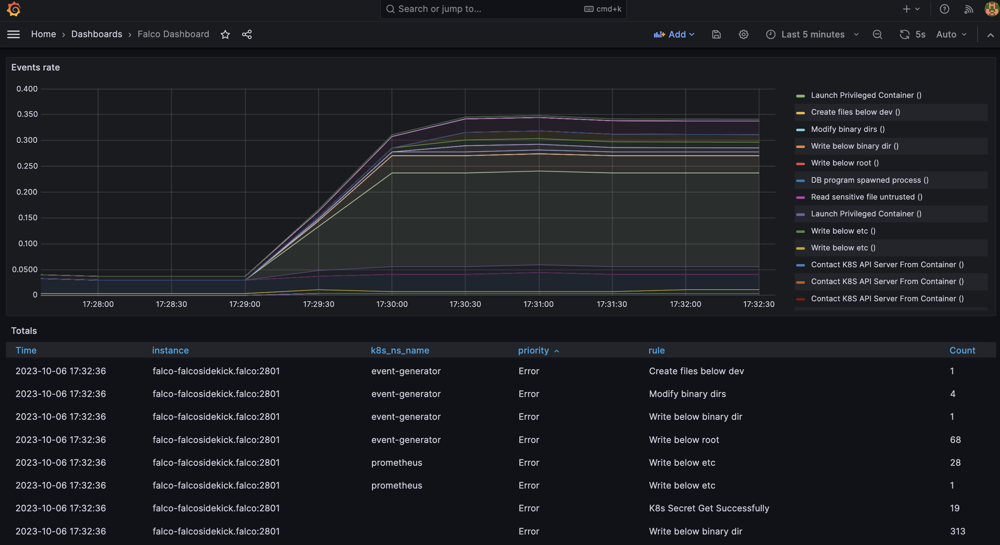

# K8s Summit 2023 Rntime Security

[](https://speakerdeck.com/rich0423/runtime-security-protection-for-web-applications-on-k8s)

##  Hands-on - Kubernetes audit logs and Falco Integration (k8saudit plugin)

### Enable K8s audit log and install Falco
- create an audit policy file ``
- create `kube-apiserver` configuration would set Falco as a backend webhook ``

- create a Minukube cluster and enbale auditing
```
minikube start \
    --extra-config=apiserver.audit-policy-file=/etc/ssl/certs/audit-policy.yaml \
    --extra-config=apiserver.audit-log-path=- \
    --extra-config=apiserver.audit-webhook-config-file=/etc/ssl/certs/webhook-config.yaml \
    --extra-config=apiserver.audit-webhook-batch-max-size=10 \
    --extra-config=apiserver.audit-webhook-batch-max-wait=5s \
    --cpus=4
```

- install Prometheus, Grafana and Falco using helmfile.
```
helmfile sync
```

### Trigger Falco events from K8s audit logs

- run a privileged pod
```
kubectl apply -f privileged-pod.yaml
```

- create a ConfigMap containing credentials
```
kubectl apply -f bad-configmap.yaml
```

- Check the Falco pod logs/events
```
kubectl logs -l app.kubernetes.io/name=falco -n falco -c falco
```

### Using Falco Sidekick UI and Grafana dashboard

- `forward-ports.sh` to access to the apps from your local machine:
  - [Prometheus](http://localhost:9090)
  - [Grafana](http://localhost:3000)
  - [Falco Sidekick UI](http://localhost:2802)



- `get-grafana-creds.sh` to get Grafana credentials for the UI.

- login and import [Falco dashboard](https://grafana.com/grafana/dashboards/11914-falco-dashboard/)



- [Event generator](https://github.com/falcosecurity/event-generator)

```
helm install event-generator falcosecurity/event-generator \
  --namespace event-generator \
  --create-namespace \
  --set config.loop=false \
  --set config.actions=""
```

## References
- [Try Falco on Kubernetes](https://falco.org/docs/getting-started/falco-kubernetes-quickstart/)
- [Falco on Kind with Prometheus and Grafana](https://falco.org/blog/falco-kind-prometheus-grafana/)


