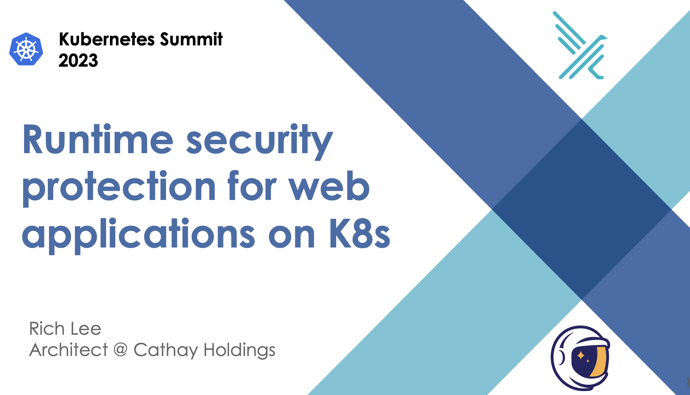

# K8s Summit 2023 Rntime Security



##  Hands-on - Kubernetes audit logs and Falco Integration (k8saudit plugin)

### Enable K8s audit log and install Falco
- create an audit policy file
- create **kube-apiserver** configuration would set Falco as a backend webhook

- create a Minukube cluster and enbale auditing
```
minikube start \
    --extra-config=apiserver.audit-policy-file=/etc/ssl/certs/audit-policy.yaml \
    --extra-config=apiserver.audit-log-path=- \
    --extra-config=apiserver.audit-webhook-config-file=/etc/ssl/certs/webhook-config.yaml \
    --extra-config=apiserver.audit-webhook-batch-max-size=10 \
    --extra-config=apiserver.audit-webhook-batch-max-wait=5s \
    --cpus=4
```

- install Prometheus and Falco using helmfile.
```
helmfile sync
```

### Trigger Falco events example


